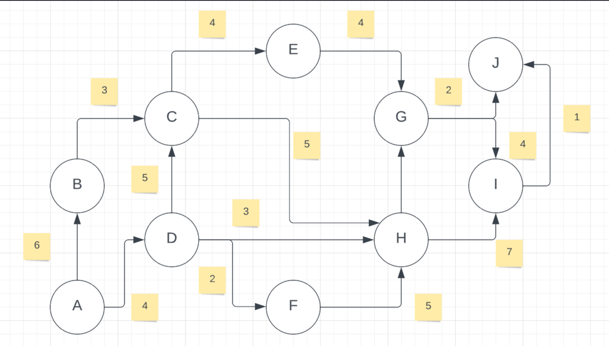

Мем


# Алгоритм Форда-Фалкерсона 
Метод предназначен для распределенной системы динамического управления потоками информации в сетях связи, позволяет найти кратчайшие пути от всех узлов сети к одному общему входящему узлу.

Был придуман в 1954 году двумя учёными - Фордом Л.Р. и Фалкерсоном Д.Р.
Это достаточно простой, но действенный алгоритм - позволяющий определять максимальную пропускную способность потока в направленном графе.


## Алгоритм работает следующим образом:

 1. Начинаем с нулевого потока и выбираем увеличивающий путь, который будет увеличивать поток сети.

 2. Если увеличивающий путь существует, увеличиваем поток по нему и переходим к шагу 1.

 3. Если увеличивающих путей больше нет, мы находим максимальный поток в сети.

 4. Увеличивающий путь - это путь от источника к стоку, который может быть увеличен путем увеличения потока через минимальное ребро на этом пути.

Процесс поиска увеличивающего пути может быть реализован различными способами, например, с помощью поиска в ширину или глубину. Однако, в общем случае, итерационный алгоритм нахождения увеличивающего пути может занять время, пропорциональное числу ребер в графе, что может привести к экспоненциальной сложности алгоритма в худшем случае.


## Задача:

Задание мы [возьмём с предыдущего раза](https://github.com/trofimovby/Dijkstra_algorithms/blob/main/README.md), когда делали алгоритм Дейкстры.



Решим её с помощью Алгоритма Форда-Фалкерсона

Задача найти максимальный поток! Не оптимальный путь, а максимум, который можно пропустить через него.

Для начала создадим матрицу расстояний для нашего графа.

## Пояснение кода:

Функция max_flow использует алгоритм Форда-Фалкерсона для
нахождения максимального потока в сети, заданной в виде графа.
Алгоритм заключается в последовательном поиске увеличивающих 
путей из источника в сток и увеличении потока на этих путях до тех пор,
пока не будет достигнут максимальный поток.

Входные параметры функции:

'graph': матрица смежности, представляющая сеть в виде графа. 
Каждый элемент матрицы graph[i][j] соответствует пропускной способности 
ребра между вершинами i и j. Если ребра между вершинами нет,
то значение равно 0.

'source': вершина-источник.

'sink': вершина-сток.


````  def max_flow(graph, source, sink):

    def bfs(graph, source, sink, parent):

        visited = [False] * len(graph)
        queue = [source]
        visited[source] = True

        while queue:
            u = queue.pop(0)

            for idx, val in enumerate(graph[u]):
                if not visited[idx] and val > 0:
                    queue.append(idx)
                    visited[idx] = True
                    parent[idx] = u

                    if idx == sink:
                        return True

        return False

    parent = [-1] * len(graph)
    max_flow = 0
````

Внутри функции определена вспомогательная функция bfs,
которая реализует поиск пути в графе с помощью
алгоритма обхода в ширину (BFS).
Эта функция используется для поиска увеличивающих путей
в алгоритме Форда-Фалкерсона.

Функция bfs работает следующим образом:

Создается список visited, в котором будут храниться флаги посещения вершин. 
Изначально он заполняется значениями False.
Создается очередь queue с начальным элементом source.
Вершина source помечается как посещенная (visited[source] = True).
Пока очередь не пуста:
Извлекается первый элемент u из очереди.
Для каждого смежного элемента v с вершиной u,
для которого еще не был выполнен поиск и его пропускная способность больше 0, 
выполняются следующие действия:
Добавляется вершина v в конец очереди queue.
В visited отмечается, что вершина v посещена (visited[v] = True).
В словаре parent для вершины v устанавливается значение u.
Если v равно sink, то возвращается True, так как был найден путь из source в sink.
Если путь из source в sink не был найден, возвращается False.
После определения функции bfs основная функция max_flow начинает работу.

```
        while bfs(graph, source, sink, parent):
        path_flow = float("Inf")
        s = sink

        while s != source:
            path_flow = min(path_flow, graph[parent[s]][s])
            s = parent[s]

        max_flow += path_flow
        v = sink

        while v != source:
            u = parent[v]
            graph[u][v] -= path_flow
            graph[v][u] += path_flow
            v = parent[v]

    return max_flow
```


Внутри цикла while происходит последовательный поиск
увеличивающих путей и увеличение потока на этих путях.
Поиск увеличивающих путей реализован с помощью функции bfs. 
Если найден путь из источника в сток, то определяется
максимальный поток, который может пройти по этому пути.
Далее этот поток увеличивается на найденном пути, 
а пропускные способности ребер на этом пути уменьшаются соответственно.
Этот процесс продолжается до тех пор,
пока не будет достигнут максимальный поток.

На выходе функция max_flow возвращает значение максимального потока в сети. 


